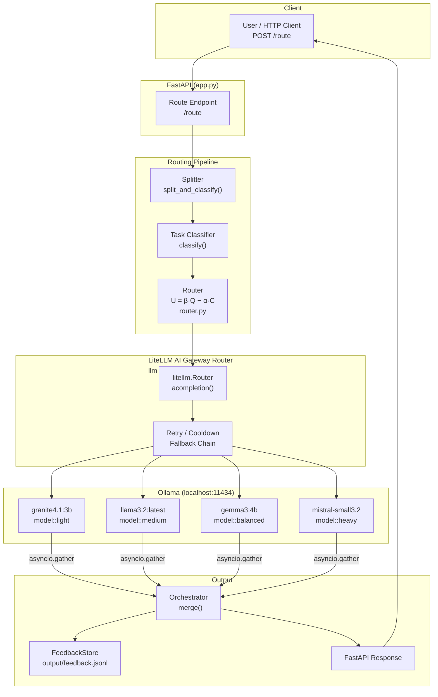
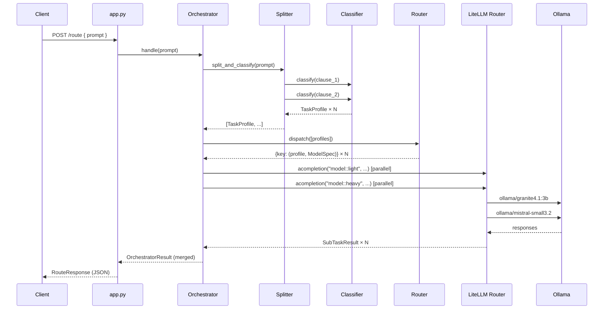
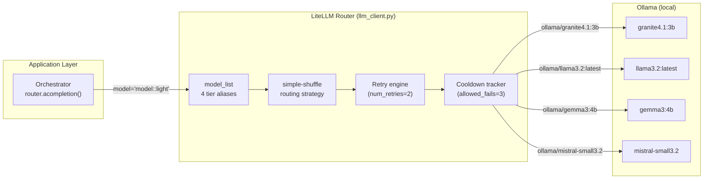

# Architecture — Multi-LLM Task Router (LiteLLM Edition)

> **Version:** 1.0.0  
> **Backend:** Ollama (local) via LiteLLM AI Gateway Router

---

## High-Level Architecture



---

## Component Responsibilities

| Component | File | Responsibility |
|---|---|---|
| **FastAPI App** | `app.py` | HTTP entry point, request/response models, demo runner |
| **Splitter** | `src/splitter.py` | Split compound prompts on conjunction markers |
| **Task Classifier** | `src/task_classifier.py` | Keyword + phrase detection → `TaskProfile` (type, complexity, tier) |
| **Router** | `src/router.py` | Utility-function model selection `U = β·Q − α·C` |
| **LLM Client** | `src/llm_client.py` | **LiteLLM Router** singleton — maps tier aliases to `ollama/<model>` |
| **Orchestrator** | `src/orchestrator.py` | `asyncio.gather` parallel execution + response merge |
| **Cost Registry** | `src/cost_registry.py` | Abstract 4-tier model specs (quality curves, costs, `capable_types`) |
| **Feedback Store** | `src/feedback.py` | Append-only JSONL metrics store |
| **demo.sh** | `scripts/demo.sh` | Self-contained terminal demo — venv bootstrap + `DRY_RUN` support |
| **start.sh** | `scripts/start.sh` | Launch FastAPI server in detached mode (`nohup`) |
| **stop.sh** | `scripts/stop.sh` | Graceful `SIGTERM` shutdown via PID file |

---

## Data Flow Sequence



---

## LiteLLM Gateway Integration



The **utility-based router** (`router.py`) decides **which tier** to use.  
The **LiteLLM Router** (`llm_client.py`) handles **how to call** that tier reliably.

---

## Complexity Scoring

```
final_score = min(1.0,  base_score  +  token_factor  +  depth_penalty)

  base_score    from keyword/phrase matching  (task-type specific)
  token_factor  = min(0.15,  log10(tokens) × 0.05)
  depth_penalty = min(0.20,  count(multi-step markers) × 0.04)

  tier:  LOW    [0.00 – 0.34]
         MEDIUM [0.35 – 0.64]
         HIGH   [0.65 – 1.00]
```

## Utility Function

```
U = β·Q − α·C    (β = 0.60, α = 0.40)

  Q = model.quality_score(complexity)  ∈ [0, 1]
  C = model.cost_per_1k                ∈ [0, 1]  (normalised; Mistral = 1.0)
```

The model with the **highest U** that also passes the per-task quality threshold wins.
