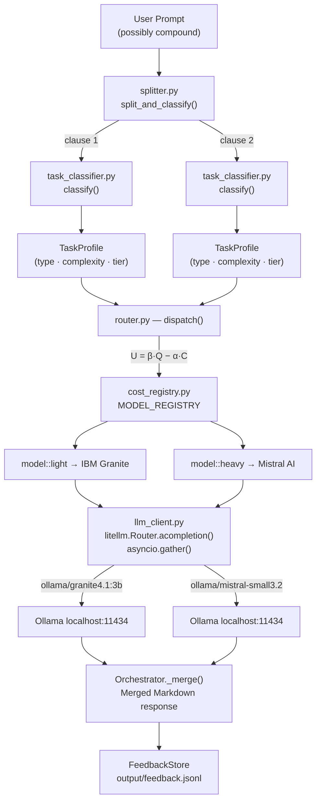

# Routing Pipeline — Multi-LLM Task Router (LiteLLM Edition)

> **Version:** 1.0.0 | **Document date:** 2026-07-01

---

## Table of Contents

1. [Overview](#overview)
2. [Pipeline Stages](#pipeline-stages)
   - [Stage 1 — Split](#stage-1--split)
   - [Stage 2 — Classify](#stage-2--classify)
   - [Stage 3 — Route](#stage-3--route)
   - [Stage 4 — Execute via LiteLLM](#stage-4--execute-via-litellm)
   - [Stage 5 — Merge & Record](#stage-5--merge--record)
3. [Pipeline Flow Diagram](#pipeline-flow-diagram)
4. [Model Tier Registry](#model-tier-registry)
5. [The `REASONING` Task Type](#the-reasoning-task-type)
6. [LiteLLM Router Configuration](#litellm-router-configuration)
7. [End-to-End Example](#end-to-end-example)

---

## Overview

The routing pipeline is a **5-stage process** orchestrated end-to-end by
[`src/orchestrator.py`](../src/orchestrator.py). The core routing logic is
**identical** to `multi-llm-router`; the key difference is that all LLM I/O
goes through the **LiteLLM AI Gateway Router** instead of raw `httpx` calls.

```
User Prompt
    │
    ▼  split_and_classify()   ← splitter.py
[clause 1] [clause 2] …
    │
    ▼  classify()             ← task_classifier.py
TaskProfile × N  (type · complexity · tier)
    │
    ▼  dispatch() / route()   ← router.py  (U = β·Q − α·C)
(profile, ModelSpec) × N
    │
    ▼  asyncio.gather()       ← orchestrator.py
litellm.Router.acompletion() × N (parallel)
    │                         ← llm_client.py
    ▼  ollama/<model>         ← Ollama (localhost:11434)
SubTaskResult × N
    │
    ▼  _merge()               ← orchestrator.py
Merged Markdown + FeedbackStore
```

---

## Pipeline Stages

### Stage 1 — Split ([`src/splitter.py`](../src/splitter.py))

`split_and_classify()` tokenises the raw prompt on conjunction markers using a
compiled regex:

```
and also | and then | additionally | plus | as well as | AND | also
```

Each resulting clause is stripped and filtered (empty or < 8 chars are discarded).
If no split is found, the whole prompt is treated as a single task.

**Example:**

> *"Write the API reference documentation for our REST /users endpoints **AND**
> implement the OAuth2 Bearer-token middleware in Python FastAPI."*

→ two independent clauses:

- `"Write the API reference documentation for our REST /users endpoints"`
- `"implement the OAuth2 Bearer-token middleware in Python FastAPI."`

---

### Stage 2 — Classify ([`src/task_classifier.py`](../src/task_classifier.py))

Each clause is passed to `classify()`, which returns a **`TaskProfile`**:

| Field | Description |
|---|---|
| `task_type` | One of 6 `TaskType` enum values |
| `complexity` | Float `[0.0 → 1.0]` |
| `tier` | `LOW` / `MEDIUM` / `HIGH` |
| `token_estimate` | Rough token count (`len(text) // 4`) |

#### Task Types & Base Scores

| TaskType | Sample Keywords | Base Score |
|---|---|---|
| `DOCUMENTATION` | `api reference`, `write docs`, `explain` | 0.20 |
| `CODE_GENERATION` | `implement`, `build`, `middleware` | 0.55 |
| `CODE_REVIEW` | `review`, `audit`, `security` | 0.60 |
| `REASONING` | `architecture`, `trade-off`, `compare` | **0.80** |
| `QA_SIMPLE` | `what is`, `how does`, `define` | 0.10 |
| `SUMMARISATION` | `summarise`, `tldr`, `condense` | 0.15 |

#### Complexity Score Formula

```
final_score = min(1.0,  base_score  +  token_factor  +  depth_penalty)

  token_factor  = min(0.15,  log10(tokens) × 0.05)
  depth_penalty = min(0.20,  count(multi-step markers) × 0.04)
```

---

### Stage 3 — Route ([`src/router.py`](../src/router.py))

`route(profile)` selects the **optimal `ModelSpec`** using a utility function:

```
U = β·Q − α·C

  β = 0.60  (quality weight)
  α = 0.40  (cost weight)
  Q = model.quality_score(complexity)   ∈ [0, 1]
  C = model.cost_per_1k  (normalised)   ∈ [0, 1]
```

#### Per-task Quality Thresholds

| Task Type | Threshold |
|---|---|
| `summarisation` | 0.55 |
| `qa_simple` | 0.55 |
| `documentation` | 0.60 |
| `code_generation` | 0.72 |
| `reasoning` | 0.80 |
| `code_review` | **0.85** (+ security override → always `model::heavy`) |

---

### Stage 4 — Execute via LiteLLM ([`src/llm_client.py`](../src/llm_client.py))

This is the stage that differs from the plain Ollama version.

Instead of a raw `httpx.AsyncClient.post()`, every LLM call goes through a
**`litellm.Router` singleton** initialised at module import:

```python
_router = Router(
    model_list=[
        {
            "model_name": "model::light",
            "litellm_params": {
                "model": "ollama/granite4.1:3b",
                "api_base": "http://localhost:11434",
            }
        },
        # … one entry per tier
    ],
    routing_strategy="simple-shuffle",
    num_retries=2,
    retry_after=2,
    allowed_fails=3,
    cooldown_time=30,
)
```

The call site:

```python
response = await _router.acompletion(
    model="model::light",        # ← symbolic tier label
    messages=[{"role": "user", "content": prompt}],
    max_tokens=max_tokens,
    temperature=0.3,
)
text   = response.choices[0].message.content  # OpenAI-compatible
tokens = response.usage.completion_tokens
```

LiteLLM translates `"model::light"` → `"ollama/granite4.1:3b"` and calls
`http://localhost:11434/v1/chat/completions`.

**Resilience features added by LiteLLM Router:**

| Feature | Behaviour |
|---|---|
| Retries | Up to `num_retries=2` attempts with `retry_after=2 s` back-off |
| Cooldown | Deployment marked unavailable for `cooldown_time=30 s` after `allowed_fails=3` consecutive failures |
| Fallback | Router picks the next available deployment in the model group |
| Multi-node | Add extra entries with the same `model_name` to load-balance across Ollama nodes |

All sub-tasks are still dispatched with `asyncio.gather()`:

```python
sub_results = await asyncio.gather(
    *[_exec(k, p, m) for k, (p, m) in routing.items()]
)
```

---

### Stage 5 — Merge & Record

`Orchestrator._merge()` assembles all responses into one Markdown document:

```markdown
## Documentation  _(via model::light [IBM Granite], 312 ms)_

…IBM Granite response…

---

## Code Generation  _(via model::heavy [Mistral AI], 1 840 ms)_

…Mistral response…
```

Metrics are appended to `output/feedback.jsonl` and exposed at `GET /feedback`.

---

## Pipeline Flow Diagram



---

## Model Tier Registry

Defined in [`src/cost_registry.py`](../src/cost_registry.py):

| Label | Tier | Provider | Ollama Model | Cost/1k | Max Tokens | Quality Score |
|---|---|---|---|---|---|---|
| `model::light` | 1 | IBM Granite | `granite4.1:3b` | 0.05 | 16 384 | `max(0, 1.0 − c×1.4)` |
| `model::medium` | 2 | Meta LLaMA | `llama3.2:latest` | 0.28 | 32 768 | `0.72 + c×0.08` |
| `model::balanced` | 3 | Google Gemma | `gemma3:4b` | 0.35 | 32 768 | `0.78 + c×0.12` |
| `model::heavy` | 4 | Mistral AI | `mistral-small3.2:latest` | 1.00 | 128 000 | `0.90 + c×0.10` |

`capable_types` matrix:

| Task Type | light | medium | balanced | heavy |
|---|:---:|:---:|:---:|:---:|
| `documentation` | ✓ | ✓ | ✓ | ✓ |
| `summarisation` | ✓ | ✓ | ✓ | ✓ |
| `qa_simple` | ✓ | ✓ | ✓ | ✓ |
| `code_generation` | | ✓ | ✓ | ✓ |
| `code_review` | | | ✓ | ✓ |
| `reasoning` | | | ✓ | ✓ |

---

## The `REASONING` Task Type

`TaskType.REASONING` represents prompts requiring **architectural thinking, design
decisions, and trade-off analysis** — the most intellectually demanding category.

### Detection keywords

```
"architecture", "design", "trade-off", "compare",
"evaluate", "pros and cons", "should i", "best approach"
```

### Routing behaviour

- **Base complexity:** `0.80` — highest in the system
- **Quality threshold:** `0.80` — only `model::balanced` (Gemma) and `model::heavy` (Mistral) qualify
- **Decision:** utility `U = 0.60·Q − 0.40·C`
  - Low complexity → Gemma wins (cheaper, threshold met)
  - High complexity → Mistral may win if quality gain outweighs cost penalty

### Example

> *"What is the best architecture for a microservices payment gateway — saga or
> 2-phase commit? Evaluate the trade-offs."*

Hits `"architecture"` + `"trade-off"` → `REASONING`, depth penalty +0.08 →
final complexity ≈ `0.93` → routed to **Mistral AI** (`model::heavy`) via
`litellm.Router.acompletion("model::heavy", ...)`.

---

## LiteLLM Router Configuration

The router singleton is in [`src/llm_client.py`](../src/llm_client.py).

### Routing strategy

| Strategy | When to use |
|---|---|
| `simple-shuffle` (default) | Single Ollama node — random pick |
| `latency-based-routing` | Multi-node — tracks p50 latency |
| `cost-based-routing` | Multi-provider — picks cheapest |

To add a second Ollama node for load-balancing, add another entry with the same
`model_name`:

```python
{
    "model_name": "model::heavy",
    "litellm_params": {
        "model": "ollama/mistral-small3.2:latest",
        "api_base": "http://ollama-node-2:11434",
    }
},
```

LiteLLM Router will automatically balance and fail over between them.

---

## End-to-End Example

**Prompt:**
> *"Write the API reference documentation for our REST /users endpoints AND
> implement the OAuth2 Bearer-token middleware in Python FastAPI."*

| Step | Detail |
|---|---|
| Split | 2 clauses (docs + code) |
| Classify 1 | `DOCUMENTATION`, complexity `0.258`, tier `LOW` |
| Classify 2 | `CODE_GENERATION`, complexity `0.612`, tier `MEDIUM` |
| Route 1 | `model::light` → IBM Granite |
| Route 2 | `model::heavy` → Mistral AI |
| LiteLLM call 1 | `router.acompletion("model::light")` → `ollama/granite4.1:3b` |
| LiteLLM call 2 | `router.acompletion("model::heavy")` → `ollama/mistral-small3.2:latest` |
| Execute | Both calls run in parallel via `asyncio.gather()` |
| Merge | Two Markdown sections joined with `---` |
| Record | Metrics written to `output/feedback.jsonl` |
