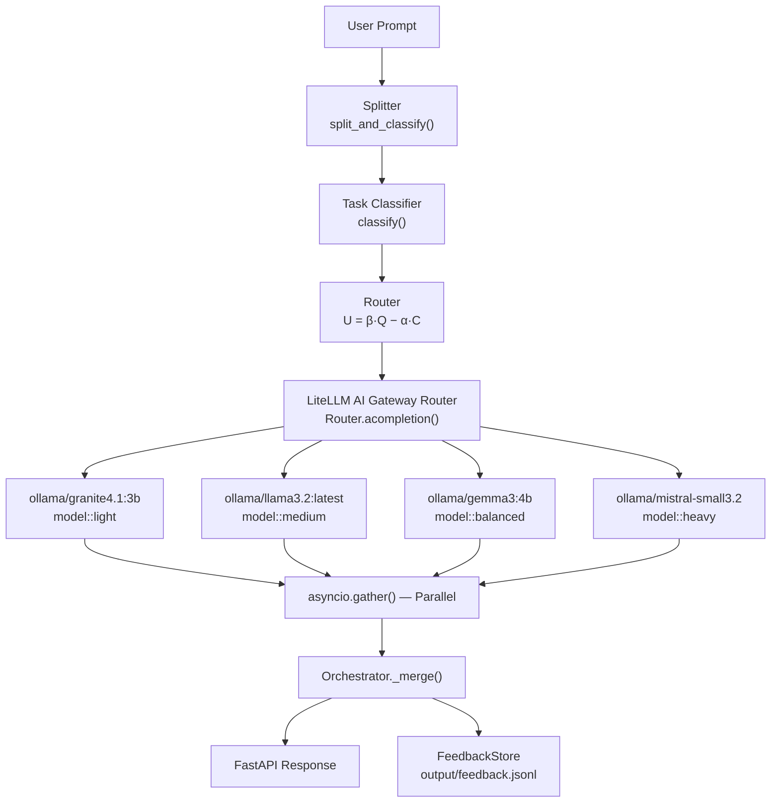

# Multi-LLM Task Router — LiteLLM Edition

> Routes compound prompts to the cheapest local model that meets a quality threshold,
> using the **LiteLLM AI Gateway Router** as transport layer over **Ollama**.

[](https://www.python.org/)
[](https://github.com/BerriAI/litellm)
[](https://ollama.ai)
[](https://fastapi.tiangolo.com)
[](LICENSE)

---

## What it does

Given a single (possibly compound) prompt the application:

1. **Splits** it into independent sub-task clauses (`AND`, `additionally`, …)
2. **Classifies** each clause into a typed `TaskProfile` with a complexity score
3. **Routes** each profile to the cheapest model tier that passes a quality threshold
   using a utility function **U = β·Q − α·C**
4. **Executes** all sub-tasks **in parallel** through the **LiteLLM AI Gateway Router**
   which dispatches to local Ollama models — adding retries, cooldowns and fallbacks
5. **Merges** the responses into a single Markdown document
6. **Records** latency / token / cost metrics to `output/feedback.jsonl`

### Compared to the plain Ollama version

| Capability | Plain (`multi-llm-router`) | LiteLLM Edition |
|---|---|---|
| LLM transport | Raw `httpx` → Ollama `/api/generate` | LiteLLM Router → Ollama `/v1/chat/completions` |
| Retries / back-off | Manual | Automatic (configurable) |
| Deployment cooldown | ✗ | ✓ |
| Fallback chain | ✗ | ✓ |
| Multi-node load balancing | ✗ | ✓ |
| Response format | Ollama-native JSON | OpenAI-compatible |
| Swap to cloud provider | Code change required | Change `model:` in `.env` only |

---

## Architecture



---

## Model Tiers

| Label | Tier | Provider | Ollama Model | Best For |
|---|---|---|---|---|
| `model::light` | 1 | IBM Granite | `granite4.1:3b` | Docs, summaries, QA |
| `model::medium` | 2 | Meta LLaMA | `llama3.2:latest` | Code, CRUD, general |
| `model::balanced` | 3 | Google Gemma | `gemma3:4b` | Reasoning, analysis |
| `model::heavy` | 4 | Mistral AI | `mistral-small3.2:latest` | Security, auth, arch |

---

## Quickstart

### Prerequisites

- Python 3.11+
- [Ollama](https://ollama.ai) installed and running (`ollama serve`)
- At least one model pulled (e.g. `ollama pull granite4.1:3b`)

### Install & run

```bash
# 1. Pull required Ollama models
ollama pull granite4.1:3b
ollama pull llama3.2:latest
ollama pull gemma3:4b
ollama pull mistral-small3.2:latest

# 2. Make scripts executable
chmod +x scripts/demo.sh scripts/start.sh scripts/stop.sh

# 3a. Run the demo scenario directly in the terminal (no server needed)
./scripts/demo.sh

# 3b. Or: start the FastAPI server in detached mode
./scripts/start.sh
```

> **Dry-run mode** — inspect routing decisions without calling any LLM:
> ```bash
> DRY_RUN=1 ./scripts/demo.sh
> ```

See [`Docs/Quickstart.md`](Docs/Quickstart.md) for the full step-by-step guide.

---

## API

### `POST /route`

```json
{
  "prompt": "Write the API docs AND implement the OAuth2 middleware",
  "dry_run": false
}
```

**Response:**

```json
{
  "prompt": "...",
  "sub_tasks": [
    {
      "task_type": "documentation",
      "complexity": 0.258,
      "tier": "LOW",
      "model": "model::light",
      "provider": "IBM Granite",
      "latency_ms": 312,
      "out_tokens": 214,
      "cost_units": 0.0000107,
      "response": "..."
    }
  ],
  "merged_output": "## Documentation  _(via model::light [IBM Granite], 312 ms)_\n\n...",
  "total_ms": 1840
}
```

### `GET /feedback`

Returns aggregated routing statistics.

### `GET /health`

```json
{"status": "ok", "gateway": "LiteLLM Router → Ollama"}
```

---

## Project Structure

```
multi-llm-router-LiteLLM/
├── app.py                      # FastAPI entry point + demo scenario
├── requirements.txt
├── .env.example                # Environment variable template
├── src/
│   ├── task_classifier.py      # Keyword-based task type + complexity scoring
│   ├── splitter.py             # Conjunction-based prompt splitting
│   ├── cost_registry.py        # 4-tier model registry (labels, costs, quality curves)
│   ├── router.py               # Utility function U = β·Q − α·C
│   ├── llm_client.py           # ★ LiteLLM Router — all LLM I/O goes here
│   ├── orchestrator.py         # Parallel execution + merge
│   └── feedback.py             # JSONL metrics store
├── scripts/
│   ├── demo.sh                 # ★ Run the worked scenario in the terminal
│   ├── start.sh                # Start FastAPI server in detached mode
│   └── stop.sh                 # Graceful server shutdown
├── Docs/
│   ├── Architecture.md
│   ├── Quickstart.md
│   └── RoutingPipeline.md
├── input/                      # Place input documents here
└── output/                     # feedback.jsonl, server.log written here
```

---

## Configuration

Copy `.env.example` to `.env` and edit:

```bash
# Swap to a different Ollama model for any tier — no code changes needed
LLM_LIGHT=granite4.1:3b
LLM_MEDIUM=llama3.2:latest
LLM_BALANCED=gemma3:4b
LLM_HEAVY=mistral-small3.2:latest

# Or point at a remote OpenAI-compatible endpoint
OLLAMA_BASE_URL=http://my-ollama-server:11434
```

---

## License

MIT © 2026
