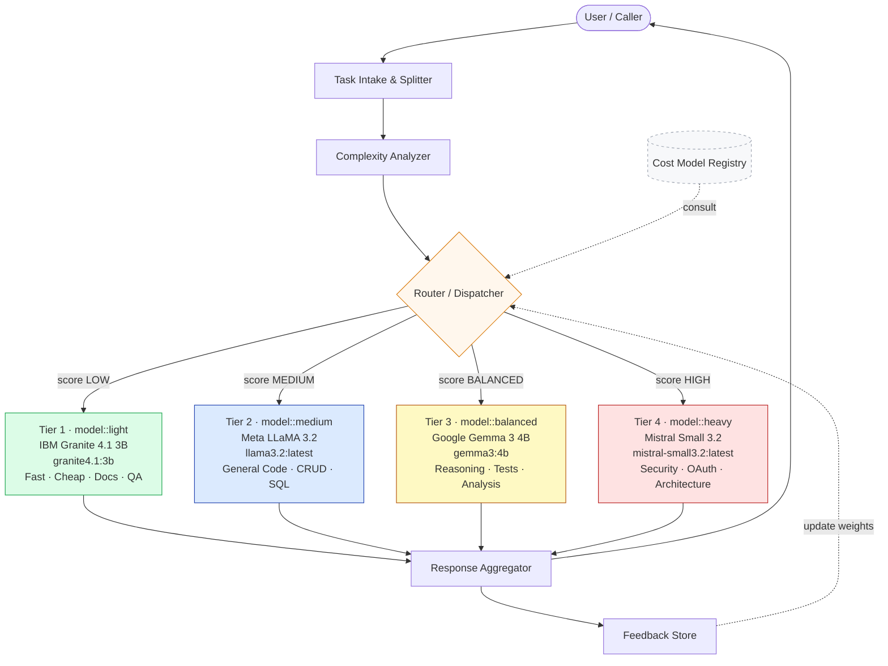
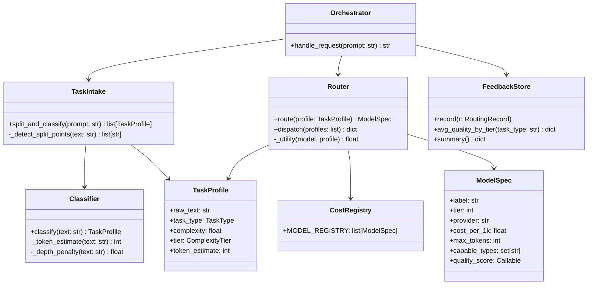
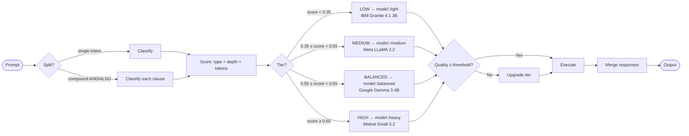
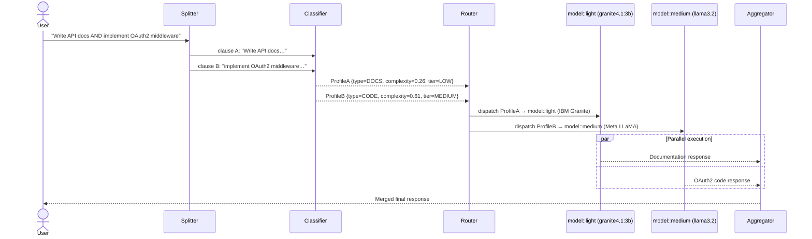

# Multi-LLM Task Router — Architecture

This document describes the theoretical and implemented architecture of an intelligent task router that dispatches LLM sub-tasks to the cheapest model tier that meets a quality threshold.

The implementation uses **4 real LLM providers** running locally via Ollama, demonstrating that the routing layer is completely provider-agnostic.

---

## System Architecture

---

## Provider Diversity

The 4 tiers deliberately span 4 independent LLM providers to demonstrate that routing is **provider-agnostic**. The symbolic labels (`model::light`, `model::medium`, `model::balanced`, `model::heavy`) are resolved to real model names at runtime via environment variables.

| Tier | Symbolic Label | Provider | Ollama Model | Specialisation |
|------|---------------|----------|--------------|----------------|
| 1 | `model::light` | **IBM Granite** | `granite4.1:3b` | Docs, summaries, simple QA |
| 2 | `model::medium` | **Meta LLaMA** | `llama3.2:latest` | General code, CRUD, SQL |
| 3 | `model::balanced` | **Google Gemma** | `gemma3:4b` | Reasoning, tests, analysis |
| 4 | `model::heavy` | **Mistral AI** | `mistral-small3.2:latest` | Security, auth, architecture |

---

## Component Breakdown

---

## Routing Decision Flow

---

## Worked Scenario — Documentation vs. Code Split

> **Security scenario:** a `code_review` task is always forced to `model::heavy` (Mistral Small 3.2) via the security override — regardless of complexity score.

---

## Cost Model

| Tier | Label | Provider | Ollama Model | Relative cost / 1K tokens | Quality (low complexity) | Quality (high complexity) |
|------|-------|----------|--------------|---------------------------|--------------------------|---------------------------|
| 1 | `model::light`    | IBM Granite | `granite4.1:3b`               | 0.05 (normalised) | High | Low |
| 2 | `model::medium`   | Meta LLaMA  | `llama3.2:latest`             | 0.20 (normalised) | High | Medium |
| 3 | `model::balanced` | Google Gemma | `gemma3:4b`                  | 0.35 (normalised) | High | Medium-High |
| 4 | `model::heavy`    | Mistral AI  | `mistral-small3.2:latest`     | 1.00 (normalised) | High | High |

**Utility function:** `U = 0.6 × Quality − 0.4 × Cost`  
The router selects the model that maximises U while satisfying the per-task quality threshold.

**Per-task quality thresholds:**

| Task type | Threshold | Reason |
|-----------|-----------|--------|
| `documentation` | 0.60 | Prose tolerates lighter models |
| `summarisation` | 0.55 | Even more lenient |
| `qa_simple` | 0.55 | Factual lookups need less depth |
| `code_generation` | 0.72 | Code correctness matters |
| `reasoning` | 0.80 | Architecture requires depth |
| `code_review` | forced Tier 4 | Security override — always Mistral |
