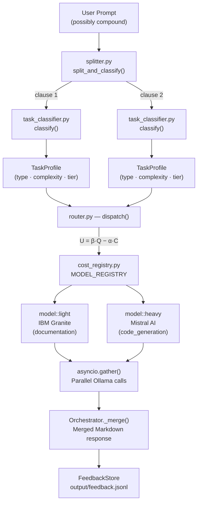

# Multi-LLM Task Router — Routing Pipeline & Reasoning Task

> **Document version:** 2026-07-01  
> **Applies to:** `multi-llm-router` v1.0.0

---

## Table of Contents

1. [Overview](#overview)
2. [Pipeline Stages](#pipeline-stages)
   - [Stage 1 — Split](#stage-1--split-splitterpy)
   - [Stage 2 — Classify](#stage-2--classify-task_classifierpy)
   - [Stage 3 — Route](#stage-3--route-routerpy)
   - [Stage 4 — Execute](#stage-4--execute-orchestratorpy)
   - [Stage 5 — Merge & Record](#stage-5--merge--record)
3. [Pipeline Flow Diagram](#pipeline-flow-diagram)
4. [Model Tier Registry](#model-tier-registry)
5. [The `REASONING` Task Type](#the-reasoning-task-type)
6. [End-to-End Example](#end-to-end-example)

---

## Overview

The routing pipeline is a **5-stage process** orchestrated end-to-end by
[`src/orchestrator.py`](../src/orchestrator.py). Given a single (possibly compound)
user prompt, it:

1. Splits it into independent sub-task clauses.
2. Classifies each clause into a typed, scored `TaskProfile`.
3. Routes each profile to the cheapest model that meets a quality threshold.
4. Executes all sub-tasks in **parallel** via `asyncio.gather()`.
5. Merges the results into a single Markdown response and persists metrics.

---

## Pipeline Stages

### Stage 1 — Split ([`splitter.py`](../src/splitter.py))

`split_and_classify()` tokenises the raw prompt on conjunction markers using a
compiled regex:

```
and also | and then | additionally | plus | as well as | AND | also
```

Each resulting clause is stripped and filtered (empty or < 8 chars are discarded).
If no split is found, the whole prompt is treated as a single task.

**Example:**

> *"Write the API reference documentation for our REST /users endpoints **AND**
> implement the OAuth2 Bearer-token middleware in Python FastAPI."*

→ two independent clauses:
- `"Write the API reference documentation for our REST /users endpoints"`
- `"implement the OAuth2 Bearer-token middleware in Python FastAPI."`

---

### Stage 2 — Classify ([`task_classifier.py`](../src/task_classifier.py))

Each clause is passed to `classify()`, which returns a **`TaskProfile`**:

| Field | Description |
|---|---|
| `task_type` | One of 6 `TaskType` enum values (see below) |
| `complexity` | Float `[0.0 → 1.0]` — computed score |
| `tier` | `LOW` / `MEDIUM` / `HIGH` based on complexity |
| `token_estimate` | Rough token count (`len(text) // 4`) |

#### Task Types

| TaskType | Keywords (sample) | Base Score |
|---|---|---|
| `DOCUMENTATION` | `api reference`, `write docs`, `document`, `explain` | 0.20 |
| `CODE_GENERATION` | `implement`, `build`, `middleware`, `endpoint` | 0.55 |
| `CODE_REVIEW` | `review`, `audit`, `security`, `vulnerability` | 0.60 |
| `REASONING` | `architecture`, `trade-off`, `compare`, `should i` | **0.80** |
| `QA_SIMPLE` | `what is`, `how does`, `define` | 0.10 |
| `SUMMARISATION` | `summarise`, `tldr`, `condense` | 0.15 |

#### Complexity Score Formula

```
final_score = min(1.0,  base_score  +  token_factor  +  depth_penalty)

  token_factor  = min(0.15,  log10(tokens) × 0.05)
  depth_penalty = min(0.20,  count(multi-step markers) × 0.04)
```

Multi-step markers that increase depth penalty: `"step 1"`, `"however,"`,
`"trade-off"`, `"on the other hand"`, `"furthermore"`, etc.

#### Phrase-Level Overrides (highest priority)

Certain multi-word phrases force a task type before keyword scoring:

| Phrase | Forced Type |
|---|---|
| `"api reference"` | `DOCUMENTATION` |
| `"code review"` | `CODE_REVIEW` |
| `"security audit"` | `CODE_REVIEW` |

---

### Stage 3 — Route ([`router.py`](../src/router.py))

`route(profile)` selects the **optimal `ModelSpec`** using a utility function:

```
U = β·Q − α·C

  β = 0.60  (quality weight)
  α = 0.40  (cost weight)
  Q = model.quality_score(complexity)   ∈ [0, 1]
  C = model.cost_per_1k  (normalised)   ∈ [0, 1]
```

A **higher U** means the model is preferred (maximises quality, penalises cost).

#### Selection Rules (in order)

1. Model must list the `task_type` in its `capable_types`.
2. Model `max_tokens` must cover the estimated token budget.
3. Model `quality_score` must meet the **per-task quality threshold**:

| Task Type | Quality Threshold |
|---|---|
| `summarisation` | 0.55 |
| `qa_simple` | 0.55 |
| `documentation` | 0.60 |
| `code_generation` | 0.72 |
| `reasoning` | 0.80 |
| `code_review` | **0.85** |

4. Among all qualifying candidates → **highest U wins**.
5. **Fallback:** if no candidate passes the threshold, the highest-quality model is used regardless of cost.
6. **Security override:** `code_review` always forces `model::heavy` (Mistral AI).

---

### Stage 4 — Execute ([`orchestrator.py`](../src/orchestrator.py))

All routed sub-tasks are dispatched **concurrently**:

```python
sub_results = await asyncio.gather(
    *[_exec(k, p, m) for k, (p, m) in routing.items()]
)
```

Each `_exec` coroutine calls the local **Ollama** instance with the appropriate
model, records latency and token count, and writes an entry to the feedback store.

---

### Stage 5 — Merge & Record

`Orchestrator._merge()` assembles all sub-task responses into a single Markdown
document, labelling each section with the task type, model used, and latency:

```markdown
## Documentation  _(via model::light, 312 ms)_

…IBM Granite response…

---

## Code Generation  _(via model::heavy, 1 840 ms)_

…Mistral response…
```

Metrics (latency, tokens, cost units) are appended to `output/feedback.jsonl`
and exposed via `GET /feedback`.

---

## Pipeline Flow Diagram



---

## Model Tier Registry

Defined in [`src/cost_registry.py`](../src/cost_registry.py):

| Label | Tier | Provider | Cost/1k (norm.) | Max Tokens | Quality Score |
|---|---|---|---|---|---|
| `model::light` | 1 | IBM Granite (`granite4.1:3b`) | 0.05 | 16 384 | `max(0, 1.0 − c×1.4)` — degrades fast above 0.4 |
| `model::medium` | 2 | Meta LLaMA (`llama3.2:latest`) | 0.28 | 32 768 | `0.72 + c×0.08` — solid mid-range |
| `model::balanced` | 3 | Google Gemma (`gemma3:4b`) | 0.35 | 32 768 | `0.78 + c×0.12` — strong reasoning |
| `model::heavy` | 4 | Mistral AI (`mistral-small3.2:latest`) | 1.00 | 128 000 | `0.90 + c×0.10` — near-ceiling quality |

`capable_types` per model:

| Task Type | light | medium | balanced | heavy |
|---|:---:|:---:|:---:|:---:|
| `documentation` | ✓ | ✓ | ✓ | ✓ |
| `summarisation` | ✓ | ✓ | ✓ | ✓ |
| `qa_simple` | ✓ | ✓ | ✓ | ✓ |
| `code_generation` | | ✓ | ✓ | ✓ |
| `code_review` | | | ✓ | ✓ |
| `reasoning` | | | ✓ | ✓ |

---

## The `REASONING` Task Type

`TaskType.REASONING` represents prompts requiring **architectural thinking, design
decisions, and trade-off analysis** — the most intellectually demanding category.

### Detection

Triggered by keywords (single-keyword scoring, phase 2):

```
"architecture", "design", "trade-off", "compare",
"evaluate", "pros and cons", "should i", "best approach"
```

### Why the highest base score?

Its base complexity of **0.80** is the largest in the system. This reflects the
fact that reasoning tasks are inherently open-ended: they require the model to
weigh multiple options, apply domain knowledge, and produce a structured argument
rather than just retrieve or transform text.

### Routing behaviour

- **Quality threshold:** `0.80` — eliminates `model::light` (IBM Granite) and
  `model::medium` (Meta LLaMA), which are not in `capable_types` for reasoning anyway.
- **Eligible models:** `model::balanced` (Gemma) and `model::heavy` (Mistral).
- **Decision rule:** utility `U = 0.60·Q − 0.40·C`
  - At low complexity, Gemma wins (cheaper, still meets threshold).
  - At high complexity, Mistral can win if its quality gain outweighs the cost penalty.

### Example prompt

> *"What is the best architecture for a microservices payment gateway — should I
> use a saga pattern or 2-phase commit? Evaluate the trade-offs."*

This hits `"architecture"`, `"trade-off"` → `REASONING`, depth penalty adds
`0.08` → final complexity ≈ `0.93` → routed to **Mistral AI** (`model::heavy`).

---

## End-to-End Example

**Prompt:**
> *"Write the API reference documentation for our REST /users endpoints AND
> implement the OAuth2 Bearer-token middleware in Python FastAPI."*

| Step | Result |
|---|---|
| Split | 2 clauses (docs + code) |
| Classify clause 1 | `DOCUMENTATION`, complexity `0.258`, tier `LOW` |
| Classify clause 2 | `CODE_GENERATION`, complexity `0.612`, tier `MEDIUM` |
| Route clause 1 | `model::light` → IBM Granite (U = +0.553) |
| Route clause 2 | `model::heavy` → Mistral AI (quality threshold 0.72 met only by heavy/balanced; heavy wins on U at this complexity) |
| Execute | Both LLM calls run in parallel via `asyncio.gather()` |
| Merge | Two Markdown sections joined with `---` separator |
| Record | Latency, tokens, cost written to `output/feedback.jsonl` |
