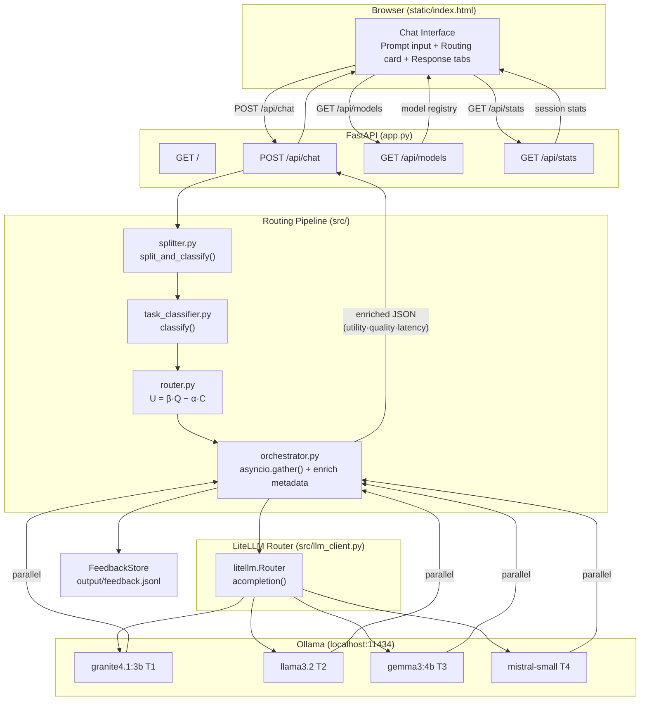

# Architecture — LLM Routing Chat UI

---

## System Overview



---

## UI Component Map

```markdown
┌─────────────────────────────────────────────────────────────────┐
│  Sidebar                │  Main                                  │
│  ─────────────────────  │  ────────────────────────────────────  │
│  Model Registry         │  Top bar (title + dry-run toggle)      │
│   T1 IBM Granite        │                                        │
│   T2 Meta LLaMA         │  Chat Thread                           │
│   T3 Google Gemma       │   ┌─ User bubble ──────────────────┐   │
│   T4 Mistral AI         │   │  "Write API docs AND OAuth2"   │   │
│                         │   └────────────────────────────────┘   │
│  Formula                │   ┌─ Routing Card ─────────────────┐   │
│  U = 0.60·Q − 0.40·C   │   │  🔀 2 sub-tasks detected       │    │
│                         │   │  ┌ documentation  T1 Granite ┐ │   │
│  Session Stats          │   │  │ complexity 26% Q 64% U+0.36│ │  │
│   Total calls           │   │  └────────────────────────────┘ │  │
│   Avg quality           │   │  ┌ code_generation T3 Gemma  ┐ │   │
│   Total cost            │   │  │ complexity 61% Q 85% U+0.37│ │  │
│                         │   │  └────────────────────────────┘ │  │
│                         │   └────────────────────────────────┘   │
│                         │   ┌─ Response Card ─────────────────┐  │
│                         │   │ [T1 documentation][T3 code][⊞]  │  │
│                         │   │  📡 IBM Granite  ⏱ 312ms  📝 214│ │
│                         │   │  <rendered markdown response>   │  │
│                         │   └────────────────────────────────┘   │
│                         │                                        │
│                         │  Input area (textarea + send button)   │
└─────────────────────────┴────────────────────────────────────────┘
```

---

## Component Responsibilities

| Component | File | Responsibility |
|---|---|---|
| **Chat UI** | `static/index.html` | Full SPA: chat thread, routing visualiser, model sidebar, stats |
| **FastAPI App** | `app.py` | HTTP server, static file serving, API endpoints |
| **Splitter** | `src/splitter.py` | Split compound prompts on `AND`/`additionally`/… |
| **Task Classifier** | `src/task_classifier.py` | Keyword scoring → `TaskProfile` (type, complexity, tier) |
| **Router** | `src/router.py` | Utility `U = β·Q − α·C`, per-task quality thresholds |
| **LLM Client** | `src/llm_client.py` | LiteLLM Router singleton — maps tiers to `ollama/<model>` |
| **Orchestrator** | `src/orchestrator.py` | `asyncio.gather` execution + **enriched metadata for UI** |
| **Cost Registry** | `src/cost_registry.py` | 4-tier model specs (quality curves, costs, capable_types) |
| **Feedback Store** | `src/feedback.py` | Append-only JSONL metrics |
| **demo.sh** | `scripts/demo.sh` | Bootstrap venv + **auto-detect free port** + start server + print URL; exits with log tail on failure |

---

## Enriched Response Payload

The orchestrator exposes extra fields compared to `multi-llm-router-LiteLLM`:

```python
@dataclass
class SubTaskResult:
    # base fields (same as before)
    profile, model, response, latency_ms, out_tokens
    # new — consumed by the UI routing card
    utility_score: float   # U = β·Q − α·C
    quality_score: float   # model.quality_score(complexity)
    threshold:     float   # per-task quality threshold applied
    ollama_model:  str     # e.g. "granite4.1:3b"
    cost_units:    float   # cost_per_1k × tokens / 1000
```

---

## Utility Function

```
U = β·Q − α·C    (β = 0.60, α = 0.40)

  Q = model.quality_score(complexity)
  C = model.cost_per_1k  (normalised; Mistral = 1.0)

Per-task quality thresholds (minimum Q to qualify):
  documentation   ≥ 0.60
  summarisation   ≥ 0.55
  qa_simple       ≥ 0.55
  code_generation ≥ 0.72
  reasoning       ≥ 0.80
  code_review     ≥ 0.85  + forced T4 (security override)
```
