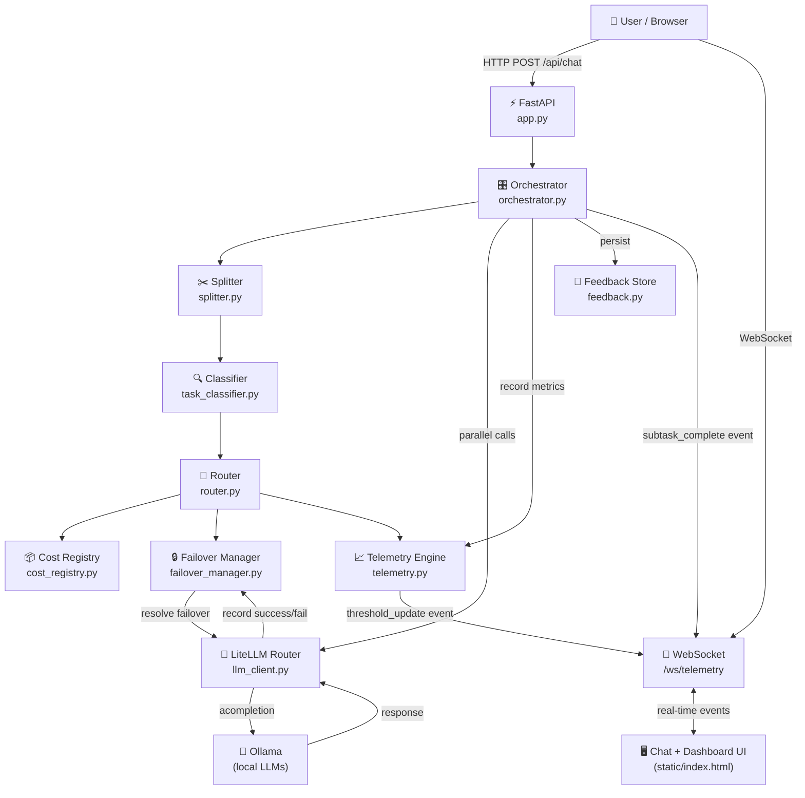
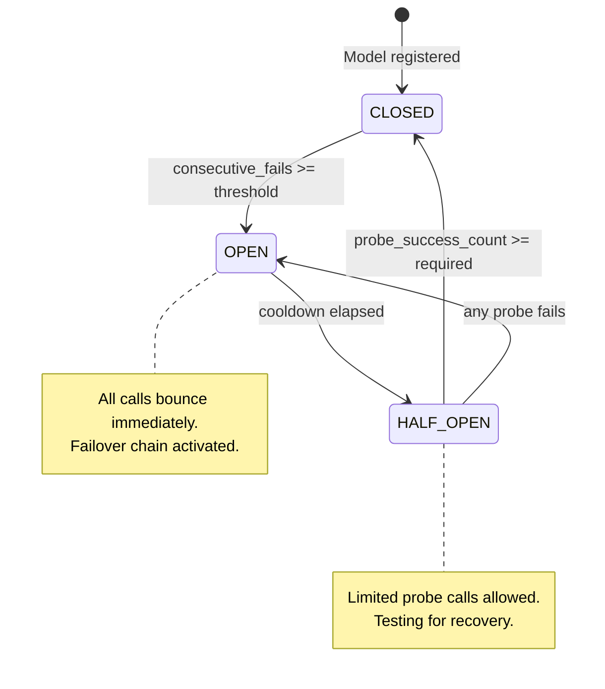
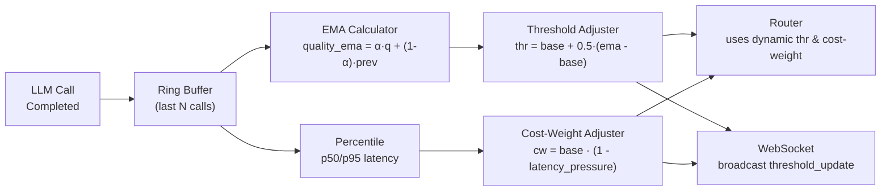
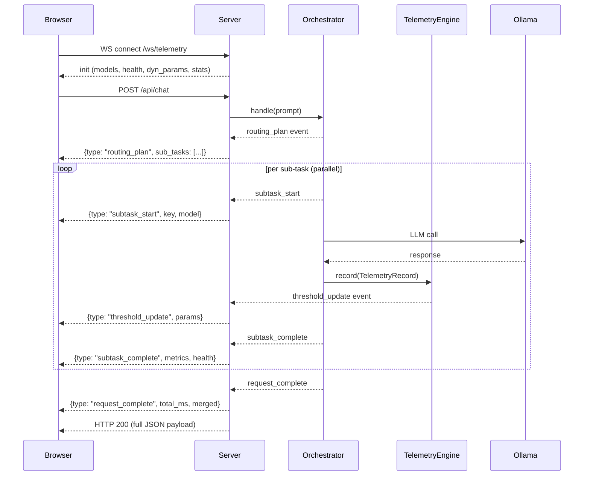

# Architecture — routing-v4

## System Architecture

---

## Failover Architecture

### Failover Chains

| Primary | Failover 1 | Failover 2 | Reason tags |
|---|---|---|---|
| `model::light` | `model::medium` | `model::balanced` | `light_degraded`, `light_circuit_open` |
| `model::medium` | `model::balanced` | `model::heavy` | `medium_degraded`, `medium_circuit_open` |
| `model::balanced` | `model::heavy` | `model::medium` | `balanced_degraded`, `balanced_circuit_open` |
| `model::heavy` | `model::balanced` | `model::medium` | `heavy_degraded`, `heavy_circuit_open` |

---

## Dynamic Threshold Optimisation

### Formula Details

| Parameter | Formula | Range |
|---|---|---|
| `quality_ema` | `α·q_new + (1−α)·q_prev` | [0, 1] |
| `quality_threshold` | `base + 0.5·(ema − base)` | [0.40, 0.95] |
| `latency_pressure` | `p95_ms / TARGET_LATENCY_MS` | [0, ∞) |
| `cost_weight` | `base × (1 − min(0.5, pressure × 0.3))` | [0.10, 0.70] |
| Utility `U` | `β·Q − α·C` where `α = cost_weight`, `β = 1−α` | (−∞, +∞) |

---

## WebSocket Event Flow

