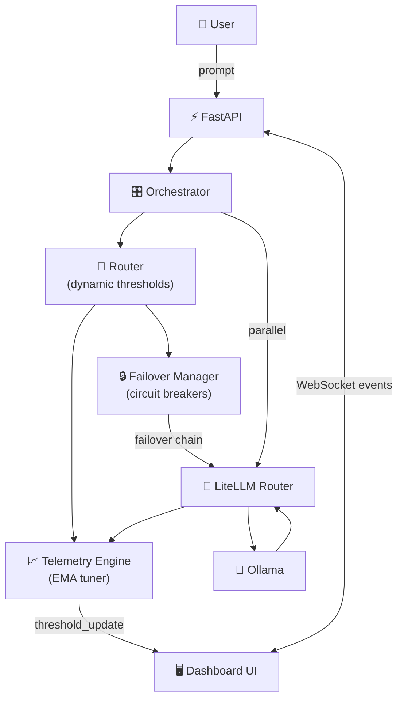

# routing-v4 — Advanced Multi-LLM Router

> **Advanced model failovers · Dynamic threshold optimisation · Real-time visual dashboard**
> Built on **LiteLLM AI Gateway → Ollama** with FastAPI, WebSockets, and Chart.js.

[](https://www.python.org/)
[](https://github.com/BerriAI/litellm)
[](https://ollama.ai)
[](https://fastapi.tiangolo.com)
[](LICENSE)

---

## What's New in v4

| Feature | Description |
|---|---|
| ⚡ **Advanced Failovers** | Per-model circuit breakers (CLOSED/OPEN/HALF_OPEN) with configurable thresholds, health-score EMA, and explicit per-task failover chains |
| 🎛 **Dynamic Thresholds** | Live telemetry ring buffers feed an EMA-based tuner that continuously adjusts `quality_threshold` and `cost_weight` per (model × task) pair |
| 📊 **Real-time Dashboard** | WebSocket-powered UI with latency timeline, tier distribution doughnut, model health bars, and live dynamic threshold visualisation |
| 🔀 **Dual-layer Routing** | LiteLLM Router handles intra-tier retries and latency-based selection; our FailoverManager handles cross-tier failover when a circuit opens |
| 🔌 **WebSocket Events** | Every routing decision, LLM completion, threshold change, and failover emits a structured event to all connected clients in real time |

---

## Architecture



See [`Docs/Architecture.md`](Docs/Architecture.md) for detailed diagrams covering:
- Full component graph
- Circuit-breaker state machine
- Dynamic threshold formula derivation
- WebSocket event sequence diagram

---

## Model Tiers

| Badge | Label | Provider | Ollama Model | Strengths |
|---|---|---|---|---|
| T1 🟢 | `model::light` | IBM Granite | `granite4.1:3b` | Docs, summaries, QA |
| T2 🔵 | `model::medium` | Meta LLaMA | `llama3.2:latest` | Code, CRUD, general |
| T3 🟣 | `model::balanced` | Google Gemma | `gemma3:4b` | Reasoning, analysis |
| T4 🔴 | `model::heavy` | Mistral AI | `mistral-small3.2:latest` | Security, auth, arch |

Each tier has an explicit **failover chain**: when a circuit opens, the next model in the chain is tried automatically.

---

## Circuit Breaker Behaviour

```
CLOSED → (3 consecutive failures) → OPEN
OPEN   → (30s cooldown)           → HALF_OPEN
HALF_OPEN → (2 probe successes)   → CLOSED
HALF_OPEN → (any probe failure)   → OPEN
```

All thresholds are configurable via `.env`.

---

## Dynamic Threshold Tuning

After each LLM call, the telemetry engine recomputes:

```
quality_threshold  = clip(base + 0.5 × (ema_quality − base),  0.40, 0.95)
cost_weight        = clip(base × (1 − latency_pressure × 0.3), 0.10, 0.70)
```

The router then uses these live values for all subsequent routing decisions, visible in real time on the **Dashboard** tab.

---

## Quickstart

```bash
# 1. Pull models
ollama pull granite4.1:3b
ollama pull llama3.2:latest
ollama pull gemma3:4b
ollama pull mistral-small3.2:latest

# 2. Start
cd routing-v4
./scripts/start.sh

# 3. Open
open http://localhost:8080

# 4. Stop
./scripts/stop.sh
```

See [`Docs/Quickstart.md`](Docs/Quickstart.md) for full configuration options.

---

## API Endpoints

| Endpoint | Method | Description |
|---|---|---|
| `/` | GET | Chat + Dashboard UI |
| `/api/chat` | POST | Route prompt, execute LLMs, return full metadata |
| `/api/models` | GET | Model registry with health and failover chains |
| `/api/stats` | GET | Aggregated routing statistics |
| `/api/health` | GET | Liveness + circuit-breaker snapshot |
| `/api/telemetry` | GET | Current dynamic parameters |
| `/api/failover/events` | GET | Recent failover event log |
| `/ws/telemetry` | WS | Real-time event stream |
| `/api/docs` | GET | Swagger / OpenAPI |

---

## Project Structure

```
routing-v4/
├── app.py                    # FastAPI + WebSocket server
├── requirements.txt
├── .env.example
├── Docs/
│   ├── Architecture.md       # System + failover + threshold diagrams
│   └── Quickstart.md
├── scripts/
│   ├── start.sh              # Launch in detached mode
│   └── stop.sh               # Graceful shutdown
├── static/
│   └── index.html            # Real-time dashboard (Chart.js + WebSocket)
├── input/                    # Input documents (processed recursively)
├── output/                   # Runtime artefacts (feedback.jsonl, logs, PID)
└── src/
    ├── cost_registry.py      # Model pool + failover chain definitions
    ├── task_classifier.py    # Task type + complexity scoring
    ├── splitter.py           # Compound prompt splitting
    ├── failover_manager.py   # Circuit breakers + health tracking
    ├── telemetry.py          # Ring buffers + EMA dynamic threshold tuner
    ├── router.py             # Routing with dynamic thresholds + failover
    ├── orchestrator.py       # Pipeline + WebSocket event emission
    ├── feedback.py           # Persistent routing records + statistics
    └── llm_client.py         # Failover-aware LiteLLM async client
```

---

## License

MIT — see [LICENSE](../LICENSE)
