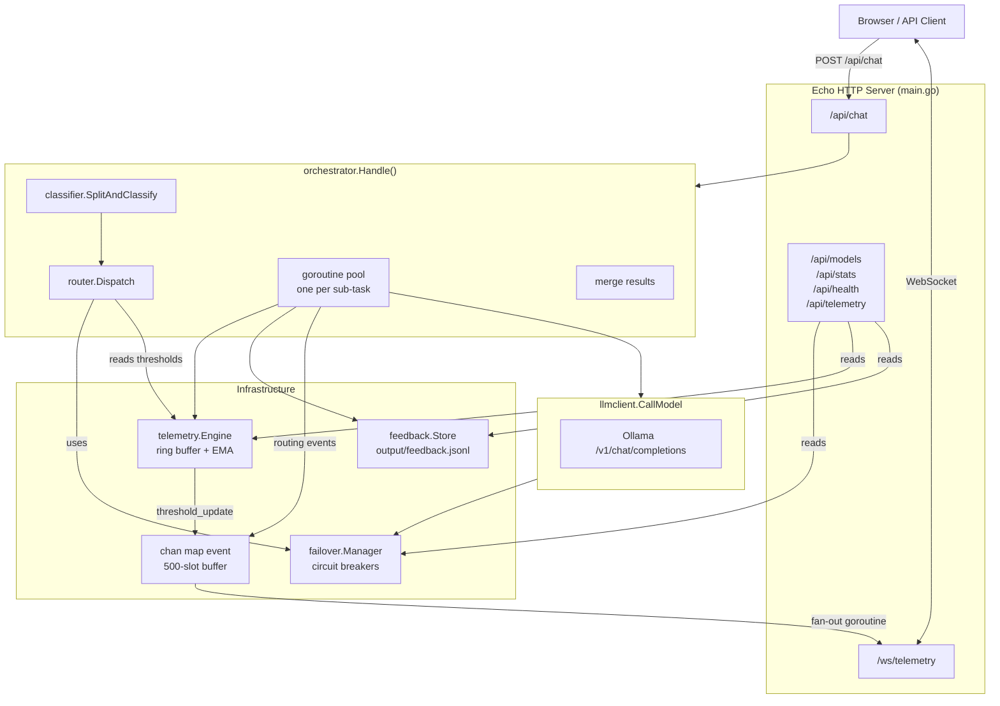
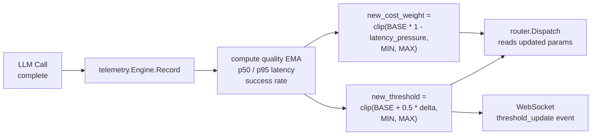
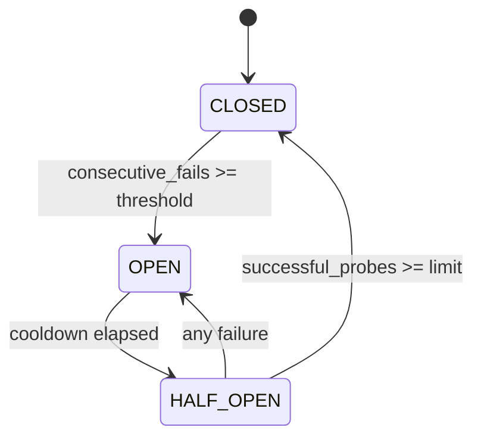
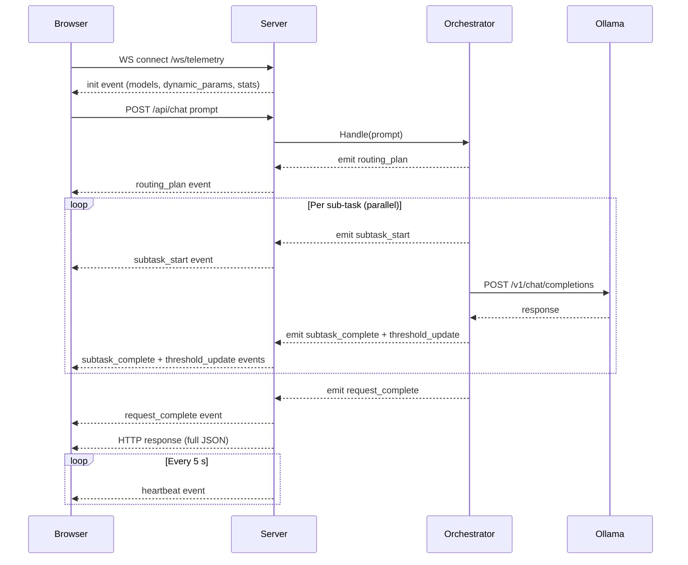

# Architecture — routing-v5 (Go Edition)

## System Overview

routing-v5 is a complete port of the Python `routing-v4` application to Go.  
It preserves the exact same HTTP API, WebSocket telemetry protocol, and intelligent
routing logic — compiled to a single self-contained binary.

---

## Component Architecture



---

## Dynamic Threshold Tuning



---

## Circuit Breaker State Machine



---

## WebSocket Event Sequence



---

## Data Flow

```
Prompt
  │
  ▼
classifier.SplitAndClassify()
  │ → []TaskProfile
  ▼
router.Dispatch()
  │ applies:  StaticTaskThresholds (blended with live telemetry EMA)
  │           Utility  U = β·Q − α·C   (β = 1 − α,  α = dynamic cost weight)
  │           failover.Manager.Resolve() for circuit-broken models
  │ → map[key]DispatchResult
  ▼
orchestrator (goroutine per sub-task)
  │ llmclient.CallModel() → Ollama
  │ telemetry.Engine.Record() → recompute thresholds
  │ feedback.Store.Record() → append to JSONL
  │ emit WebSocket events
  │ → []SubTaskResult
  ▼
merge()
  │ → Markdown merged response
  ▼
HTTP JSON response
```
